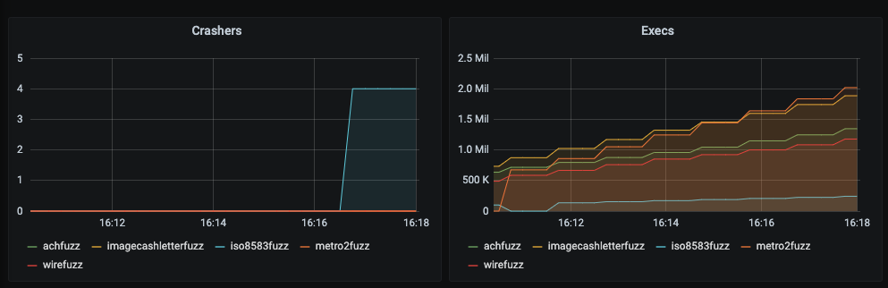

# gofuzz_exporter

[](https://travis-ci.com/adamdecaf/gofuzz_exporter)
[](https://goreportcard.com/report/github.com/adamdecaf/gofuzz_exporter)
[](https://raw.githubusercontent.com/adamdecaf/gofuzz_exporter/master/LICENSE)

`gofuzz_exporter` is a Prometheus exporter for scraping and parsing [dvyukov/go-fuzz](https://github.com/dvyukov/go-fuzz) execution logs. Currently we support grabbing logs from [Loki](https://github.com/grafana/loki) instances.

This project uses `github.com/moov-io/infra/pkg/gofuzz` to parse log lines.

### Metrics

The following metrics are exported:

- `gofuzz_corpus`: Count of corpus for a go-fuzz process
- `gofuzz_crashers`: Count of crashers for a go-fuzz process
- `gofuzz_executions`: Count of executions for a go-fuzz process
- `gofuzz_workers`: Count of workers for a go-fuzz process

### Install / Usage

You can download and run the latest docker image [`adamdecaf/gofuzz_exporter`](https://hub.docker.com/r/adamdecaf/gofuzz_exporter/) from the Docker Hub.

Running the image looks like the following:

```
$ docker run -it -p 10000:10000 adamdecaf/gofuzz_exporter:v0.1.1 -loki.address http://localhost:3100/loki/ -apps achfuzz
2020/02/29 02:04:00 starting gofuzz_exporter v0.1.1
2020/02/29 02:04:00 listenting on 0.0.0.0:10000
2020/02/29 02:04:00 using http://localhost:3100/loki/ for Loki address
```

### Graphs

You can use this project to create graphs like the following.



## License

Apache License 2.0 See [LICENSE](LICENSE) for details.
